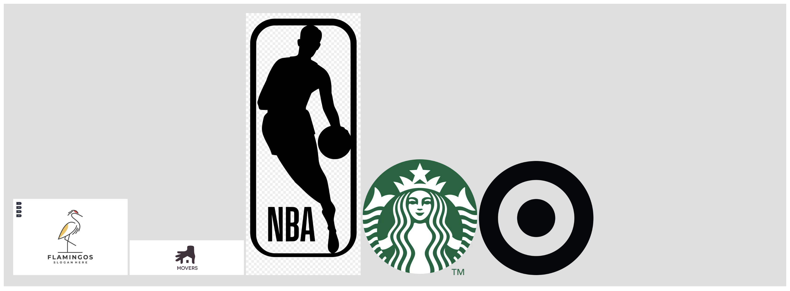
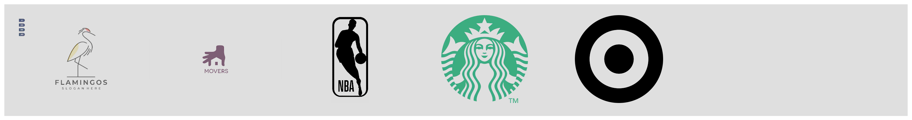

# CSS Challenge #1

If the client has sent the wrong logo, the client needs to send the correct logo

The challenge is to add CSS to achieve the following effect:

> Note: the logos used was random you can use any logo you would like to use for this challenge.